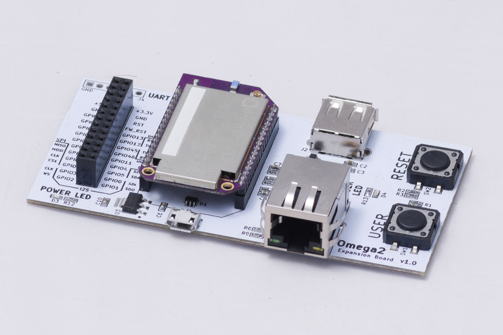
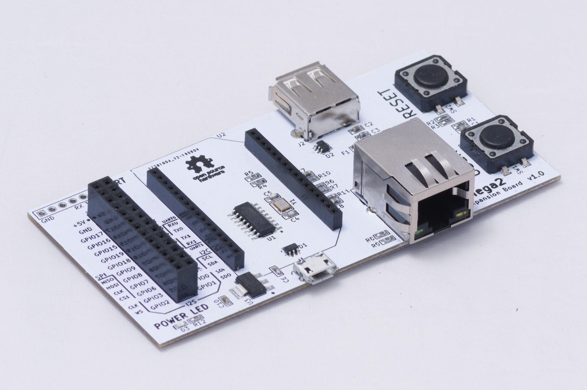
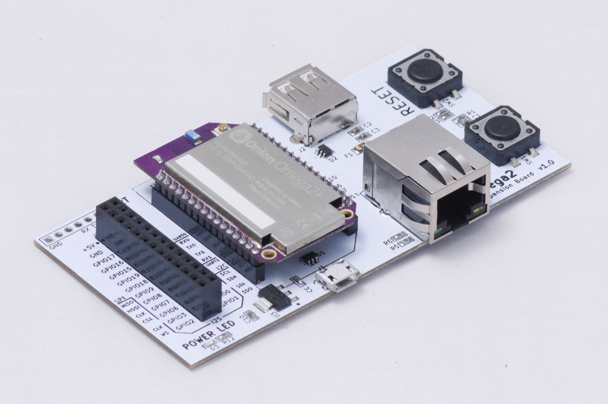

# Omega2 Dock board

Inspired by [Omega dock\new](https://github.com/5N44P/omega-dock-new) board.

## Overview

This is yet another dock for Onion Omega2/Omega2+ single board computers. 
Main board features:

* Ethernet socket
* USB type A Host
* Micro USB power and UART
* Expansion pins
* User Button and LED

## BOM

BOM is also available in CSV format.

| Reference | Quantity | Description | MPN | Manufacturer | Datasheet |
|-----------|---------:|-------------|-----|--------------|-----------|
| C10 C2  | 2 | CAP CER 10UF 6.3V X5R 0603 | CL10A106MQ8NNNC | Samsung Electro-Mechanics | [link](http://www.samsungsem.com/kr/support/product-search/mlcc/__icsFiles/afieldfile/2018/06/20/CL10A106MQ8NNNC.pdf) |
| C4 C5  | 2 | CAP CER 22pF 50V NPO 0603 | CL10C220JB8NNN | Samsung Electro-Mechanics | [link](www.samsungsem.com/global/front/downloadcms.do?path=%2F%2Fglobal%2F%2Fsupport%2F%2Fproduct-search%2F%2Fmlcc%2F%2F__icsFiles%2F%2Fafieldfile%2F%2F2016%2F%2F08%2F%2F18&fileName=S_CL10C220JB8NNNL.pdf) |
| C6 C8 C7 C1 C3  | 5 | CAP CER 0.1UF 50V X7R 0603 | CL10B104KB8NNNC | Samsung Electro-Mechanics | [link](http://www.samsungsem.com/kr/support/product-search/mlcc/__icsFiles/afieldfile/2018/07/24/CL10B104KB8NNNC.pdf) |
| C9  | 1 | CAP CER 1UF 16V X7R 0603 | CL10B105KO8NNNC | Samsung Electro-Mechanics | [link](http://www.samsungsem.com/kr/support/product-search/mlcc/__icsFiles/afieldfile/2019/06/18/CL10B105KO8NNNC-19.pdf) |
| D2 D1  | 2 | TVS DIODE 5.25V 17V SOT23-6 | USBLC6-2SC6 | STMicroelectronics | [link](http://www.st.com/content/ccc/resource/technical/document/datasheet/06/1d/48/9c/6c/20/4a/b2/CD00050750.pdf/files/CD00050750.pdf/jcr:content/translations/en.CD00050750.pdf) |
| D3 D4  | 2 | LED Yellow Green 0603 30mA | FYLS-0603GD | FORYARD OPTOELECTRONICS | [link](http://www.foryard-led.ru/pdf/fyls-0603gd.pdf) |
| F1  | 1 | PTC RESET FUSE 6V 1.1A 1206 | MF-NSMF110-2 | Bourns | [link](https://www.bourns.com/docs/Product-Datasheets/mfnsmf.pdf) |
| J1  | 1 | CONN RCPT USB2.0 MICRO B SMD R/A | 10118194-0001LF | Amphenol ICC (FCI) | [link](http://www.amphenol-icc.com/media/wysiwyg/files/drawing/10118194.pdf) |
| J2  | 1 | CONN RCPT USB2.0 TYPEA 4POS R/A | KLS1-181A-W | KLS | [link](http://www.klsele.com/admin/product_upload/20190917081512KLS1-1811%20A%20Female%20Dip%2090%20USB%20Connector%202.jpg.pdf) |
| J3  | 1 | CONN F HEADER 26POS 2.54mm | ZL262-26DG | CONNFLY | [link](http://www.kosmodrom.com.ua/pdf/zl262-dg.pdf) |
| J4  | 1 | CONN M HEADER 6 POS 2.54mm | ZL201-06G | CONNFLY | [link](http://www.kosmodrom.com.ua/pdf/zl201.pdf) |
| J5  | 1 | RJ45 connector with transformer | KLS12-TL002R-1*1-G/Y-1-03 | KLS | [link](http://www.klsele.com/admin/product_upload/20170620132005KLS12-TL002-1X1.pdf) |
| R1 R3  | 2 | SMD RES 0603 10 kOhm 100mW 50V | RC0603FR-10KR | Hitano | [link](https://www.rcscomponents.kiev.ua/datasheets/komechip-eesistor-datasheet.pdf) |
| R11 R7 R6 R10  | 4 | SMD RES 0603 49.9 Ohm 100mW 50V | RC0603FR-49R9 | Hitano | [link](https://www.rcscomponents.kiev.ua/datasheets/rc_series_hitano-datasheet.pdf) |
| R12 R4 R5 R8 R9 R2 R13  | 7 | SMD RES 0603 470 Ohm 100mW 50V | RC0603JR-470R | Hitano | [link](https://www.rcscomponents.kiev.ua/datasheets/rc_series_hitano-datasheet.pdf) |
| SW2 SW1  | 2 | SWITCH TACTILE SPST-NO 0.05A 12V | TACTM-24N-F | NINIGI | [link](https://en.ninigi.com/product/tactm-24n-f/pdf) |
| U1  | 1 | USB UART CONVERTER 16SOIC | CH340G | WCH | [link](www.datasheet5.com/pdf-local-2195953) |
| U2  | 1 | SBC  | Omega2 | Onion | [link](https://docs.onion.io/omega2-docs/omega2p.html) |
| U3  | 1 | IC REG LINEAR 3.3V 800MA SOT223  | LD1117S33TR | STMicroelectronics | [link](https://www.st.com/content/ccc/resource/technical/document/datasheet/99/3b/7d/91/91/51/4b/be/CD00000544.pdf/files/CD00000544.pdf/jcr:content/translations/en.CD00000544.pdf) |
| Y1  | 1 | Quartz Crystal SMD 12.0 MHz | 12.88662 | GEYER | [link](https://www.geyer-electronic.com/fileadmin/user_upload/frequenz/quartz/KX-7/GEYER-KX-7.pdf) |

Note:

I have bought a KLS Ethernet connector for **J5** but used a footprint for [Amphenol ICC RJMG1BD3B8K1ANR](https://www.digikey.com/product-detail/en/amphenol-icc-commercial-products/RJMG1BD3B8K1ANR/RJMG1BD3B8K1ANR-ND/5359794) connector. There is just one difference - **reversed pinout** for Yellow LED. 

Also, I have bought a KLS USB A connector for **J2** and used an [Amphenol ICC UE27AC54100](https://www.digikey.com/product-detail/en/amphenol-icc-commercial-products/UE27AC54100/UE27AC54100-ND) footprint, but they are similar, though.

## Schematic & PCB

Designed using **KiCAD**. Also, I have take some parts from [Digi-Key Kicad library](https://www.digikey.com/en/resources/design-tools/kicad). 

The library with footprints is available at the project directory [omega-dock](./omega-dock).

Board has user **Button** at **GPIO11** and **LED** at **GPIO17**. To able these ones just solder bridges **SB1** and **SB4**.

Also, to able Ethernet LEDs solder bridges **SB2** and **SB3**.

## Known bugs

I have realized that there is no fuse for a USB power socket and it may cause damage to the USB port on your PC. So, it recommends using USB 3.0 and higher.

## Other photos

